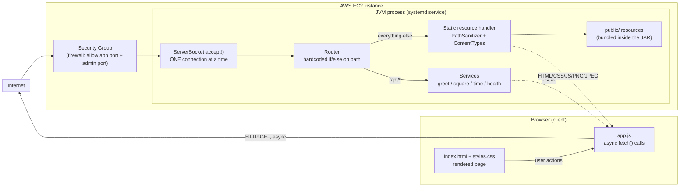

# From a Minimal HTTP Server to a Web Application on AWS

A hand-rolled, **sequential**, socket-based HTTP/1.1 server written in plain Java
(no web framework, no servlet container) that serves static resources
(HTML/CSS/JS/images) and four hardcoded JSON services, packaged as a single
runnable JAR with Maven and deployed to one AWS EC2 instance.

This is the Part 2 lab of the Networking course: it deliberately preserves the
limitation of the previous, minimal socket server — **one TCP connection
handled at a time, no threads** — so that the cost of scaling up can be
observed honestly before concurrency and distribution are introduced.

# Made BY
- Sebastian Albarracin Silva

## Table of contents

- [System metaphor and architecture](#system-metaphor-and-architecture)
- [Design decisions](#design-decisions)
- [Project structure](#project-structure)
- [Prerequisites](#prerequisites)
- [Installation and build](#installation-and-build)
- [How to run locally](#how-to-run-locally)
- [How to use the application](#how-to-use-the-application)
- [How to run the tests](#how-to-run-the-tests)
- [AWS deployment](#aws-deployment)
- [Evidence and results](#evidence-and-results)
- [Known limitations](#known-limitations)
- [Reflection](#reflection)
- [Author and acknowledgment](#author-and-acknowledgment)

## System metaphor and architecture

**System metaphor: a single-window teller counter.**

Picture a small office with one clerk (the Java server) and one service
window (the `ServerSocket`). One visitor (a browser TCP connection) steps up
to the window at a time. The clerk reads the visitor's request slip (the HTTP
request line and headers), decides whether it's a request for a document from
the filing cabinet (a static resource: HTML/CSS/JS/image) or a request for
one of four specific, memorized forms the clerk can fill out on the spot (the
hardcoded services: greet, square, time, health), hands back the answer, and
only then calls the next visitor. There is no second clerk and no ticket
queue with parallel counters — if the clerk is slow with one visitor, every
other visitor waits at the door. That is the whole point of this stage of the
lab: understand the single-counter baseline before adding more clerks.

The browser page is the visitor's *assistant*: it fills out request slips
automatically and asynchronously (so the visitor — the person looking at the
browser tab — is never frozen waiting), but it still has to queue at the same
one-clerk window as everyone else.



**Component responsibilities**

| Component | Responsibility |
|---|---|
| Browser / `index.html` + `styles.css` | Renders the page requested by the user; issues the *initial* document request. |
| `app.js` (async client) | Intercepts form/button events, builds service URLs from validated input, calls `fetch()`, shows loading/success/error states without reloading the page. |
| Security Group | AWS-level firewall: only the application port (and, temporarily, the admin/SSH port from the student's IP) is open. |
| `ServerSocket` accept loop (`HttpServerApp`) | Accepts one TCP connection, fully handles it, closes it, then accepts the next. No thread pool. |
| Router (inside `HttpServerApp.route`) | A short, explicit if/else that recognizes 4 fixed `/api/*` paths; everything else is treated as a static resource path. |
| Static resource handler (`PathSanitizer` + `ContentTypes`) | Normalizes and validates the requested path, rejects traversal attempts, maps the extension to a content type, reads the bytes from the classpath. |
| Services (`Services` class) | Four pure, stateless methods that validate query parameters and build a small JSON string each. |
| `public/` resources | HTML, CSS, JS, and images, bundled **inside the JAR** via Maven's standard resource directory. |

## Design decisions

- **Why the server stays sequential.** The lab's purpose at this stage is to
  make the baseline capacity of "one server, one worker" observable before
  concurrency is introduced. Adding a thread pool now would hide exactly the
  behavior section 6.2 asks you to measure. See
  [`HttpServerApp.main`](src/main/java/edu/eci/networkinglab/server/HttpServerApp.java) —
  the `accept()` call happens inside the same loop that fully processes the
  previous connection; there is no `Thread`, `ExecutorService`, or
  `CompletableFuture` anywhere in the request-handling path.
- **Why routes are hardcoded.** A router, annotation scanner, or
  dependency-injection container would generalize path-matching before this
  lab's goal — understanding *how* a path selects behavior — has been
  demonstrated by hand. `HttpServerApp.route` and `HttpServerApp.handleService`
  use a plain `switch` on four literal strings.
- **How content types are selected.** `ContentTypes` is a static,
  explicit `Map<String,String>` from file extension to MIME type — no
  auto-detection library, no reflection. An unmapped extension returns
  `null`, which the caller turns into a 404 instead of guessing a type.
- **How unsafe paths are rejected.** `PathSanitizer.sanitize` URL-decodes the
  path, then walks its segments with a stack: `.` is dropped, `..` pops the
  last segment (or throws `UnsafePathException` if the stack is already
  empty — i.e. the request tries to climb above the public root). Because the
  server *never* touches the filesystem directly (resources are read from the
  classpath via `ClassLoader.getResourceAsStream`, always under the fixed
  `public/` prefix), even a successfully sanitized "traversal" can only ever
  resolve to a path inside `public/`; there is no way to escape it. Both an
  encoded (`%2e%2e%2f`) and a raw (`../../`) traversal attempt were verified
  to return a 4xx with no file content, see
  [Evidence](#evidence-and-results).
- **Why the browser client is asynchronous.** `app.js` uses `fetch()` and
  `preventDefault()` so the page keeps rendering and accepting input while a
  request to the (sequential!) server is pending — this is what makes it
  possible to *observe* the server's sequential limitation in section 6.2
  without freezing the whole browser tab.
- **Never trust query input in JSON.** Every dynamic value written into a
  JSON response body goes through `Json.escape` / `Json.quoted`
  ([`Json.java`](src/main/java/edu/eci/networkinglab/server/Json.java)) so a
  name like `A"B` or a JSON-injection payload cannot break out of its string
  context (`JsonTest.preventsJsonInjectionViaUntrustedInput`).
- **Statelessness.** No session, cookie, or server-side map keeps
  per-user data between requests; every service method takes only the
  current request's parameters and returns a value — nothing is stored.

## Project structure

```
.
├── pom.xml                          # Maven build descriptor
├── src/
│   ├── main/
│   │   ├── java/edu/eci/networkinglab/server/
│   │   │   ├── HttpServerApp.java   # accept loop + routing (the entry point)
│   │   │   ├── HttpResponses.java   # writes status line + headers + body
│   │   │   ├── ContentTypes.java    # extension -> MIME type table
│   │   │   ├── PathSanitizer.java   # traversal-safe path normalization
│   │   │   ├── QueryParams.java     # query string -> Map<String,String>
│   │   │   ├── Json.java            # dependency-free JSON escaping
│   │   │   └── services/
│   │   │       ├── Services.java            # greet / square / time / health
│   │   │       └── BadRequestException.java # maps to HTTP 400
│   │   └── resources/public/        # bundled into the JAR at build time
│   │       ├── index.html
│   │       ├── styles.css
│   │       ├── app.js               # async client
│   │       └── images/
│   │           ├── logo.png
│   │           └── banner.jpg
│   └── test/java/edu/eci/networkinglab/server/   # JUnit 5 tests (separate from src/main)
│       ├── ContentTypesTest.java
│       ├── PathSanitizerTest.java
│       ├── QueryParamsTest.java
│       ├── JsonTest.java
│       └── services/ServicesTest.java
└── .gitignore
```

## Prerequisites

- **Java 17** (JDK) or newer — the project targets `--release 17`.
- **Maven 3.9+**.
- A modern browser (Chrome, Edge, Firefox) with developer tools, for the
  network-timeline evidence.
- For the AWS section: an AWS account with EC2 access, and either the
  AWS-managed browser terminal (**Session Manager** / **EC2 Instance
  Connect**) or an SSH client.

## Installation and build

```bash
git clone <your-repo-url>
cd From-a-Minimal-HTTP-Server-to-a-Web-Application-on-AWS

# Download dependencies, compile, run the unit tests
mvn clean test

# Produce the deployable artifact: target/networking-lab-webapp.jar
mvn clean package
```

The packaged JAR already contains the `public/` resources (they are copied
by Maven's standard `src/main/resources` mechanism), so `target/networking-lab-webapp.jar`
is the **single artifact** you need to run locally or transfer to EC2.

## How to run locally

```bash
# Default port 8080
java -jar target/networking-lab-webapp.jar

# Or an explicit port (first CLI argument)
java -jar target/networking-lab-webapp.jar 8099

# Or via an environment variable
PORT=8099 java -jar target/networking-lab-webapp.jar
```

Then open `http://localhost:8080/` (or whichever port you chose) in a
browser. Stop the server with `Ctrl+C` in the terminal that is running it.

The server binds to all interfaces (`new ServerSocket(port)`), so the same
command works unchanged on EC2 — only the host part of the URL changes.

## How to use the application

- **Greeting** — type a name, click *Greet me*. Calls `GET /api/greet?name=...`.
  A blank name is rejected client-side and, if bypassed, server-side (`400`).
- **Square** — type a number, click *Square it*. Calls `GET /api/square?value=...`.
  Accepts integers and decimals; a non-numeric value returns `400`.
- **Server time** — click *Ask the server*. Calls `GET /api/time`, showing the
  server's own clock (not the browser's).
- **Health check** — click *Check health*. Calls `GET /api/health`.
- **Simulate a slow request** (testing aid for section 6.2) — click *Trigger
  5s slow request*. Calls `GET /api/time?delayMs=5000`, which sleeps
  server-side before responding. Use it in one browser window while making a
  normal request in a second window to observe the sequential bottleneck.
- Every action shows a loading state on its button, then either updates the
  green result area or the red error area — the page never reloads.

## How to run the tests

Automated (unit tests, no server process needed — they test the pure logic
directly: path sanitization, content-type mapping, query parsing, JSON
escaping, and service validation/behavior):

```bash
mvn test
```

Manual (end-to-end, against the running server — see the
[functional test matrix](#evidence-and-results) below for the full list):

```bash
mvn package
java -jar target/networking-lab-webapp.jar 8099

# in another terminal
curl -i "http://localhost:8099/api/health"
curl -i "http://localhost:8099/api/greet?name=Ada"
curl -i "http://localhost:8099/api/square?value=7"
curl -i "http://localhost:8099/api/square?value=not-a-number"   # expect 400
curl -i "http://localhost:8099/nope.html"                        # expect 404
curl -i --path-as-is "http://localhost:8099/../../../../etc/passwd"  # expect 400, no file content
curl -i -X POST "http://localhost:8099/api/health"                # expect 405
```

Then open the same URL in a browser and use the DevTools **Network** tab to
confirm the HTML, `app.js`, and both images load with the correct content
types, and that the service calls happen asynchronously.

## AWS deployment

> Summary only — no private IPs, keys, or account IDs are included here.

1. **Build the artifact locally**: `mvn clean package` → `target/networking-lab-webapp.jar`.
2. **Launch** one EC2 instance (course-approved Linux image, smallest
   approved type, default VPC/public subnet), with a Security Group that
   allows:
   - the chosen connection method (SSH from *your* IP only, or none at all
     if using Session Manager / EC2 Instance Connect), and
   - a custom TCP inbound rule for the application port (e.g. `8080`).
3. **Connect** to the instance (Session Manager / EC2 Instance Connect / SSH).
4. **Install Java 17** with the distribution's package manager (e.g. Amazon
   Linux: `sudo dnf install -y java-17-amazon-corretto`).
5. **Transfer** `networking-lab-webapp.jar` to the instance (`scp` or the
   Session Manager file transfer / `aws s3 cp`).
6. **Start** it: `java -jar networking-lab-webapp.jar 8080`, first as a
   foreground smoke test, then as a `systemd` service so it survives logout
   and restarts on failure, logging to a fixed file/journal.
7. **Verify** `curl http://localhost:8080/api/health` from *inside* the
   instance, then open `http://<EC2-public-address>:8080/` from your own
   browser.
8. **Stop / clean up** when done: stop the service, terminate the instance,
   release any Elastic IP, delete the lab security group.

The full, click-by-click console steps used for this lab are kept outside
this README (screenshots only, see [Evidence](#evidence-and-results)) to
avoid embedding any account-specific detail.

## Evidence and results

mvn clean test


mvn clean package


java -jar target/networking-lab-webapp.jar 8080


http://localhost:8080/


SECTION 6


In AWS deployment


I exited and reloaded the page, and it's still working correctly.


Instance Termined


| Evidence | What it should show |
|---|---|
| Local run | Terminal running the JAR + browser at `localhost` with the page loaded. |
| Network tab | Separate `200` requests for `/`, `/styles.css`, `/app.js`, `/images/logo.png`, `/images/banner.jpg`, each with the correct `Content-Type`. |
| Service calls | DevTools Network tab showing `XHR/fetch` entries for `/api/greet`, `/api/square`, `/api/time`, `/api/health` with `200`/`400` statuses and `application/json`. |
| Error handling | A `400` from an invalid `square` input rendered as a friendly message in the red error area (not a raw stack trace). |
| Missing file | `curl -i http://.../nope.html` → `404`. |
| Unsupported method | `curl -i -X POST http://.../api/health` → `405`. |
| Path traversal | `curl -i --path-as-is http://.../../../../etc/passwd` → `400`, empty/generic body. |
| Sequential limit | Two browser windows: window A triggers the 5s slow request, window B's request (started right after) only completes once A's finishes — screenshot both Network timelines side by side. |
| Remote run | Same page loaded from the EC2 public address, with the same DevTools evidence repeated. |

## Known limitations

- The server handles **one TCP connection at a time**; there is no thread
  pool, no async I/O, and no queueing beyond the OS-level TCP backlog. A slow
  request blocks every other client.
- Only **`GET`** is implemented; any other method returns `405`.
- Routing recognizes exactly **four hardcoded service paths**; there is no
  general-purpose router.
- No authentication, no HTTPS/TLS, no database, no session state — this is a
  teaching baseline, **not** a production-ready HTTP server.
- No horizontal scaling: one EC2 instance is one capacity limit and one
  point of failure, by design, for this stage of the course.

## Reflection

1. **Why does a single HTML page cause several HTTP requests?** The HTML
   document references separate external resources (CSS, JS, images); the
   browser parses the HTML first and then issues one additional request per
   referenced resource it needs to render the page.
2. **Why must image responses be treated as bytes rather than text?**
   Images are binary formats (PNG/JPEG signatures, compressed pixel data);
   decoding/re-encoding them as characters (e.g. via a text `Charset`) would
   corrupt the bytes. Reading every resource as a raw `byte[]` and writing it
   unchanged to the socket keeps one reliable path for both text and binary.
3. **What is the role of the response content type?** It tells the browser
   how to interpret the bytes that follow (render as HTML, execute as JS,
   decode as an image) — without it, the browser would have to guess.
4. **What is hardcoded in this design, and what would a routing framework
   eventually generalize?** The four `/api/*` paths are matched with an
   explicit `switch`; a routing framework would replace that with pattern
   matching, parameter binding, and possibly annotations/reflection — useful
   at scale, but it would hide the exact mechanism this lab wants visible.
5. **Why can the browser remain responsive while the server still handles
   requests sequentially?** `fetch()` is asynchronous on the *client* side:
   it doesn't block the browser's UI thread while waiting for a response.
   That says nothing about how the *server* processes the underlying TCP
   connection — the two are independent properties.
6. **What changed when the server moved to EC2? What did not change?**
   The network boundary changed (public IP/port, security group instead of
   `localhost`) and the runtime environment changed (Linux VM instead of a
   laptop). The application code, its sequential behavior, and its single
   point of failure did not change at all.
7. **What happens when two users send slow requests at almost the same
   time?** The second user's request is accepted by the OS socket backlog
   but not processed until the server finishes the first user's request and
   calls `accept()` again — it waits, even though its own browser tab stays
   interactive.
8. **What is the next architectural limitation you would address — and why
   should concurrency come before load balancing?** Concurrency (e.g. a
   thread pool per connection) should come first because it fixes the
   single-server bottleneck this lab exposed; load balancing only makes
   sense once there is more than one capable worker to distribute requests
   across — otherwise it just relocates the same one-request-at-a-time limit
   behind an extra hop.

## Author and acknowledgment

**Author:** Sebastian Albarracin.

Built as the Part 2 deliverable for the Networking course's "From a Minimal
HTTP Server to a Web Application on AWS" lab guide. No external HTTP
framework, JSON library, or routing library was used, per the lab's
constraints; only the JDK standard library and JUnit 5 (test scope).
